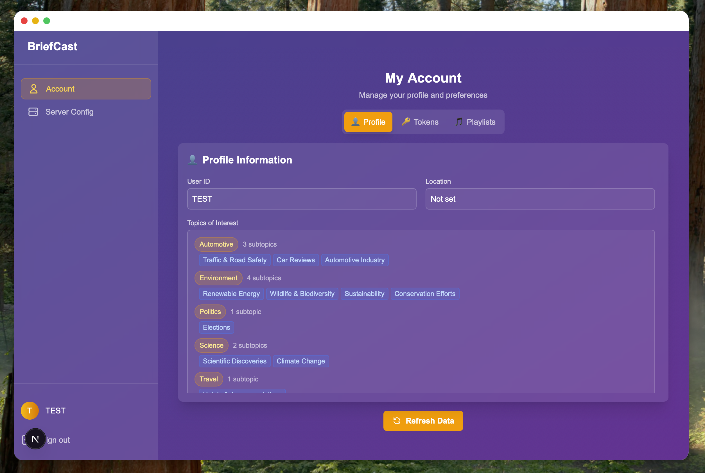
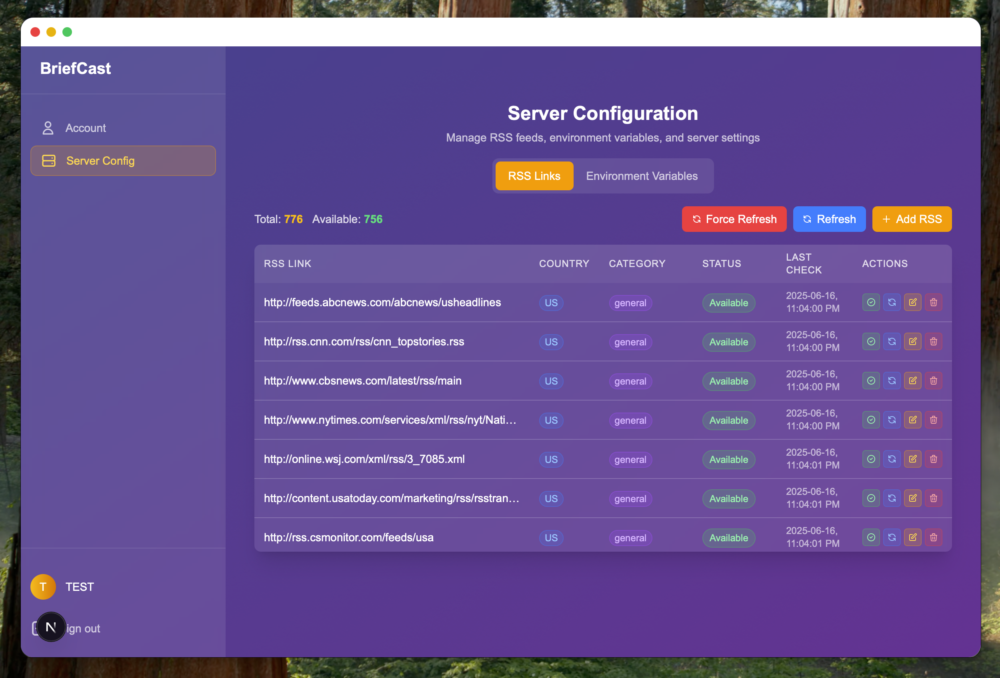
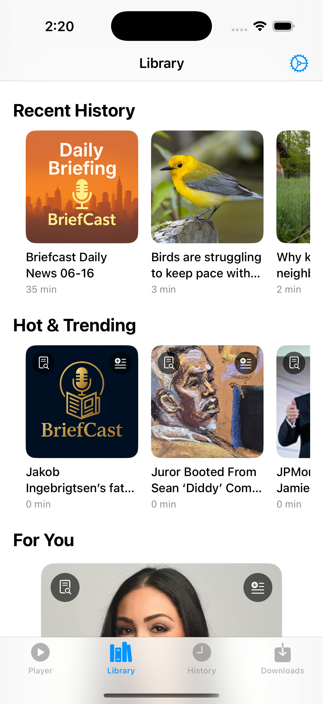
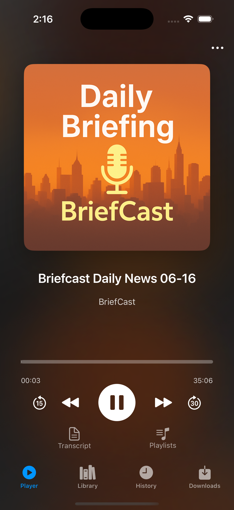
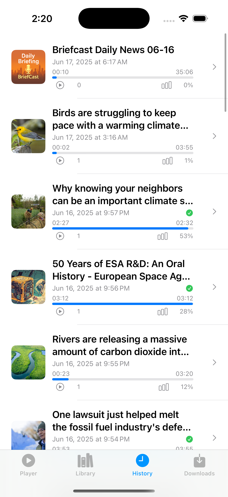

# Briefcast

<div align="center">
  
</div>

## Overview
[](https://deepwiki.com/zezhuyu/BriefCast_Pocket)

Briefcast is a cutting-edge lightweight **personalized AI-generated podcast platform** that transforms how you consume audio content. Using advanced AI technologies, Briefcast creates custom podcast episodes tailored to your interests, schedule, and preferences. Whether you're commuting, exercising, or relaxing, get personalized audio content that matters to you.

## ✨ Features

- **🤖 AI-Powered Content Generation**: Advanced language models create engaging, personalized podcast episodes
- **📱 Multi-Platform Support**: Available on Web, iOS, and Desktop (Tauri-based)
- **🎯 Personalization Engine**: Learns from your preferences to deliver relevant content
- **🔊 High-Quality Audio**: Natural text-to-speech with multiple voice options
- **📊 Smart Curation**: Intelligent content sourcing and summarization
- **⚡ Real-time Processing**: Fast content generation and delivery
- **🌐 Web Crawling**: Automated content discovery from trusted sources
- **📈 User Analytics**: Track listening habits and content preferences
- **🔗 RSS Feeds**: Subscribe to your favorite websites and RSS feeds

## 🏗️ Architecture

Briefcast is built as a comprehensive multi-platform ecosystem:

```
├── 🌐 web/          # Next.js web application
├── 📱 ios/          # Native iOS app (Swift/Xcode)
├── 🖥️ desktop/      # Cross-platform desktop app (Tauri + React)
└── 🔧 backend/      # Python backend with AI processing
```

## 🛠️ Technology Stack

### Frontend
- **Web**: Next.js 15, React 19, TypeScript, Tailwind CSS
- **iOS**: Native Swift with Xcode
- **Desktop**: Tauri with React and TypeScript

### Backend
- **Core**: Python with FastAPI and GraphQL
- **AI/ML**: 
  - Hugging Face Transformers
  - Sentence Transformers
  - PyTorch
  - Spacy for NLP
  - OpenAI integration
- **Audio**: PyDub, TTS engines
- **Data**: Vector database (Milvus), web crawling (Playwright, Scrapy)
- **Infrastructure**: Docker support, async processing

## 🚀 Quick Start

> This project has been tested on MacOS with Apple Silicon (M1, M2, etc.) 16GB+ RAM and Ubuntu 22.04 LTS 16GB+ RAM with Nvidia GPU.
> 
> You can set LOCAL_AUDIO=False in the backend/.env file to use OpenAI TTS to reduce the RAM usage.

### Backend Setup
```bash
cd backend
pip install -r requirements.txt
python api.py

# Build the project
chmod +x build.sh
./build.sh
```

### Web Application
```bash
cd web
npm install
npm run dev

# Build the project
npm install
npm run build
```

### iOS Development
```bash
cd ios
open BriefCast.xcodeproj
# Build and run in Xcode
```

### Desktop Application
```bash
cd desktop
npm install
npm run tauri dev

# Build the project
# Make sure to build the project in the backend directory first
npm install
npm run tauri build
```

## 📖 Usage

> **Note: For safety reasons, sign up and api token issue feature only available on the desktop app and can only be accessed on the same device.**
>
> mobile app need to get api token from the desktop app.
1. **Sign Up**: Create your account and set your preferences 
2. **Customize**: Choose topics, sources, and content types you're interested in
3. **Generate**: AI creates personalized podcast episodes based on your profile
4. **Listen**: Enjoy your custom content across any of our platforms
5. **Refine**: Rate content to improve future recommendations

## 🔧 Configuration

### Environment Variables
Create `.env` files in the respective directories:

**Backend** (`backend/.env`):
```env
OPENAI_API_KEY= # OpenAI API key
OPENAI_API_URL=https://api.openai.com/v1/ # OpenAI API URL or Ollama API URL
TEXT_MODEL=gpt-4.1-nano # Text generation model name
LOCAL_AUDIO=True # Whether to use local TTS or OpenAI TTS
AUDIO_MODEL=hexgrad/Kokoro-82M # Audio generation model name
```

## 📱 Platform Availability

- ✅ **Web Browser**: Access via any modern browser
- ✅ **iOS**: Native app for iPhone and iPad
- ✅ **Desktop**: Cross-platform app for Windows, macOS, and Linux

## 📝 Screenshots

### 🖥️ macOS Desktop App

<div align="center">
  
**User Management**


**Library View**


**Audio Player**


**Server Management**


</div>

### 📱 iOS Mobile App

<div align="center">
  
  

**Library View** &nbsp;&nbsp;&nbsp;&nbsp;&nbsp;&nbsp;&nbsp;&nbsp;&nbsp;&nbsp;&nbsp;&nbsp;&nbsp;&nbsp;&nbsp;&nbsp;&nbsp;&nbsp;&nbsp;&nbsp;&nbsp;&nbsp;&nbsp;&nbsp;&nbsp;&nbsp;&nbsp;&nbsp;&nbsp;&nbsp;&nbsp;&nbsp; **Audio Player** &nbsp;&nbsp;&nbsp;&nbsp;&nbsp;&nbsp;&nbsp;&nbsp;&nbsp;&nbsp;&nbsp;&nbsp;&nbsp;&nbsp;&nbsp;&nbsp;&nbsp;&nbsp;&nbsp;&nbsp;&nbsp;&nbsp;&nbsp;&nbsp;&nbsp;&nbsp;&nbsp;&nbsp;&nbsp;&nbsp;&nbsp;&nbsp; **History**

</div>

## 🛡️ Privacy & Security

- End-to-end encryption for user data
- GDPR compliant data handling
- No third-party tracking
- Local processing options available

## 📄 License

This project is licensed under the terms specified in the [LICENSE](LICENSE) file.


## 🤝 Contributing

We welcome contributions!

